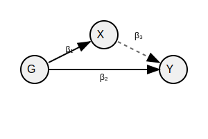

<!-- README.md is generated from README.Rmd. Please edit that file -->



```{r, child='pkgdown/index.md'}
```

<!-- Additional content -->

## Documentation

**Full documentation available here:** https://mrcieu.github.io/TwoSampleMR/
